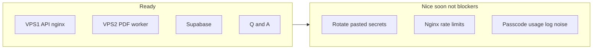

# Commercial launch — soft-launch ready

## Verdict

**Pretty much ready for invite / soft commercial launch.** Upload → PDF worker → Modal → ask path works. Supabase SQL applied. Answers confirmed OK. OpenAI health check already off.

You do not need a large hardening sprint before inviting users.

---

## Already done / not worrying about

- Answer quality / incomplete PDFs
- Supabase `subscription_details` SQL
- `HEALTH_REQUIRE_OPENAI=false`
- Modal cold start / cost (accepted)
- ASK_ASYNC (leave false; sync ask is fine)
- 2-VPS split, S3 SigV4, Modal auth on VPS2

---

## Light leftovers (do when convenient)

| Item | Priority | Notes |
|------|----------|--------|
| Rotate S3 + Modal secrets | Recommended soon | Pasted in chat; rotate when you have 15 min |
| Nginx rate limits on VPS1 | Nice | Cheap LLM cost guard; not required for small invite list |
| Passcode `increment_usage` PGRST116 | Nice | Ask still works; only noisy logs / metering edge |
| Paid Gemini + free-ask/cache env | Confirm once | If Gemini already paid and asks work, skip |
| Frontend rebuild | Only if UI still looks old | Use `ragadmin`, not root |
| ToS / Privacy | Before charging strangers at scale | Soft invite can wait |
| Stripe CANCELED+LIVE UI | Polish | Not a launch stopper |

---

## Explicitly defer

- Async ask, load test, extra API VPS, Cloudflare, pen test, monitoring dashboards

---

## If you do anything before invite

1. Quick smoke: login → ask → upload one PDF → Ready  
2. Rotate secrets when convenient  
3. Invite  

No need to treat the rest as blockers.
