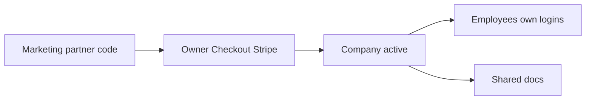

# Company seats + simple marketing referrals

## Goal (five behaviors)

1. **Owner pays** one of two Company plans on Stripe.  
2. **Each employee** = **own login** + company **join code** (no shared ID → no “too many questions” office failure).  
3. **Docs shared** inside the company (upload once).  
4. At company checkout, owner enters **marketing referral code** (optional).  
5. You see **which partner brought that paying company** → share profit with that person.

### Company pricing (AUD / month)

| Plan | Seats | Price |
|------|------:|------:|
| Company Small | up to **25** | **$499**/mo |
| Company Large | up to **50** (above 25) | **$999**/mo |

Individual Professional stays **$49**/mo. `max_seats` comes from Stripe price metadata.

**Locked decisions**
- **Owner counts as one seat** (e.g. Small 25 = owner + 24 staff).  
- **Marketing referral applies to company checkout only** (not individual $49 Professional).  
- **Referral code = attribution only** — does not unlock free/trial Professional; client must pay Stripe.  
- **Commission = recurring** — partner is owed for each month the referred company’s Stripe status stays `active` (ops pays monthly from admin list; app does not auto-payout).

Two different codes (do not mix):

| Code | Who uses it | Purpose |
|------|-------------|---------|
| **Referral code** | Company buyer at Stripe checkout | “Which marketer brought this paying company?” |
| **Company join code** | Employees after company is paid | “Join this company’s seats / shared docs” |

---

## Hard rules (keep simple)

| Do | Do not (v1) |
|----|-------------|
| Own login per employee | Shared office password |
| Owner counts as a seat | Free owner seat |
| Referral on **company** checkout only | Referral on individual Professional |
| **Two** Company Stripe prices (25 / 50 seats) | Per-seat quantity billing, mid-cycle upgrades in v1 |
| Shared docs via `documents.company_id` | Folders, ACLs, private/shared toggle |
| Admin creates **referral partners** + one code each | Full affiliate portal, auto payouts, Stripe Connect |
| Store `referred_by` on **company** at checkout | Tracking every employee click |
| Referral = **attribution only** (no free Pro unlock) | Referral code grants trial like promo passcode |
| Commission = **recurring while Stripe active** | One-time first invoice only |
| Commission = **paying company** tagged to partner | Paying on free trials / join-code only |
| Promo passcodes unchanged | Using promo passcodes as company or referral codes |

---

## Minimal data

- `referral_partners`: id, name, code (unique), is_active, notes, commission_note (e.g. “20% of first year”)  
- `companies`: id, name, owner_user_id, join_code, max_seats, stripe_subscription_id, status, **referred_by_partner_id** (nullable FK)  
- `company_memberships`: company_id, user_id, role (`owner`|`member`)  
- `documents.company_id` nullable  
- Profile: `company_id` + `subscription_source = 'company'` when joined  

No payout engine — admin looks at “active companies per partner” and pays outside the app (invoice / transfer).

---

## Minimal billing + referral capture

1. Stripe: two prices — `max_seats=25` at $499, `max_seats=50` at $999 (AUD).  
2. Admin creates partner e.g. `ACME-MKT`.  
3. Company pricing: choose Small or Large + optional **Referral code**.  
4. Checkout metadata: `user_id`, `company_id`, `referral_code`, `max_seats`.  
5. Webhook: set company `status=active`, `max_seats` from price, `referred_by_partner_id` if valid.  
6. First-come referral: do not overwrite if already set.  
7. v1: no self-serve upgrade 25→50 (buy Large / support handles later).

---

## Minimal UI

| Who | What |
|-----|------|
| Pricing | **Company Small $499** (25) / **Company Large $999** (50) + optional referral → Stripe |
| After pay | Show **company join code** + seats used |
| Employee | “Company code” → join seat |
| Docs / ask | Include company-shared documents |
| App admin | Partners list (create code) + table: partner → companies (email, status, paid) |

---

## Profit share (ops, not code)

- Contract: e.g. partner gets X% of that company’s **monthly** Stripe fee **while** subscription stays active.  
- Each month: admin report = partners → companies with `status=active` → pay that month’s share outside Augusta.  
- If company cancels / goes inactive → that month (and after) no commission.  
- App only answers: **which companies are active under whose referral** (no Stripe Connect / auto payout in v1).

---

## Explicitly later

- Seat upgrade 25→50 self-serve  
- Rotate join code, remove member  
- Email invites, individual (non-company) referral attribution  
- Auto commission calculation / Stripe Connect payouts  

---

## Success

1. Admin creates partner code `ACME-MKT`  
2. Owner checks out **Small ($499)** or **Large ($999)** with that referral → company linked to ACME, correct `max_seats`  
3. Employees join with company join code; docs shared; concurrent asks work  
4. Seat 26 rejected on Small; seat 51 rejected on Large (owner already used seat 1)  
5. Admin sees ACME → that paying company → can share profit  
6. Individual $49 checkout has **no** referral field  
7. Checkout with no / bad referral still works; company just has no partner  

---

## Build order

1. SQL: partners + companies + memberships + `documents.company_id` + join RPC  
2. Two Stripe company prices; checkout metadata + webhook → status, max_seats, referred_by  
3. Join UI + shared docs visibility  
4. Owner join-code/seats; admin partners + “paid companies by partner”  
