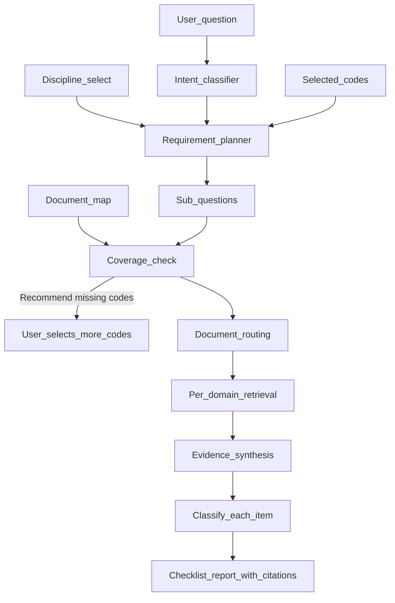

# Design Compliance Mode — planner-first architecture

## Intent (locked)

Not “better semantic search.” Build **Design Compliance Mode** where the system first asks itself:

> “Generate the full compliance question set for this design brief before answering.”

Then it retrieves evidence for each planned question and returns a **complete cited checklist/report**.

**Class 3 / electrical topic lists are examples of planner output—not hardcoded product logic.** The planner must invent the right question count and wording for **any** design brief, including ones we have never seen (e.g. a mechanical engineer asking about HVAC, ventilation, hydronics, plant rooms, Section J mechanical energy, AS 1668, etc.).

### Will it work for a mech engineer with an unknown question?

**Yes for the workflow** — same tab, same pipeline: ask anything → planner expands → route → retrieve → report. We do not need to know their question in advance.

**Quality depends on three things, not on guessing their question:**

1. **They upload and select the right codes** (e.g. NCC Vol 1 relevant parts, AS 1668, AS/NZS mechanical/energy standards they care about)—same as electrical users selecting AS 3000 / 1670 / 2293.
2. **Document map can describe those codes** (domain tags / section hints). v1 map can start with common AU electrical + fire + NCC; mechanical entries grow as users upload those standards (metadata/tags on upload or curated map rows).
3. **Explicit discipline** — user sets Mechanical (or Electrical, etc.) so the planner scopes questions to that trade instead of guessing from wording alone.

If discipline is Mechanical but they only selected electrical codes, the planner still generates mech-scoped sub-questions, then marks many rows **missing corpus**. That is correct behaviour.

User selects discipline + which uploaded codes are in play; the planner uses both (plus a document map) to route, and flags domains it cannot cover.

## Architecture shift

**From:** User question → vector search → answer  

**To:** **Discipline** + user question → intent classifier → **requirement planner** → sub-questions → document routing → retrieval → evidence synthesis → checklist with citations  

The **planner is the important piece.** Discipline is a hard input to it. Before final planning and retrieval, it can ask the engineer a small, dynamically generated set of **scoping questions** to resolve whether requirements apply. It then performs a **coverage check**: it compares the generated requirements against the selected codes and document map, then tells the user which additional codes are needed to make the report complete.

## Discipline check (required on this tab)

Before asking, the engineer chooses **discipline**. This is not inferred-only.

v1 options (single select):

- Electrical  
- Mechanical  
- Fire  
- Hydraulic  
- Multi-discipline (allow broader cross-trade question set; warn about cost/latency)  
- Other (free-text label still passed to planner)

Effects:

- Passed into the planner prompt so sub-questions match that trade (mech → HVAC/ventilation/Section J mech; electrical → supply/switchboards/detection interfaces; etc.)
- Soft-filter / suggest codes in the picker (still allow selecting any upload)
- Shown on the report cover
- Document-map routing prefers map entries tagged for that discipline

Do **not** hardcode a fixed question list per discipline—discipline steers the planner; the brief still drives how many questions and which domains.

## Requirement planner (core)

Prompt shape (conceptual):

> You are planning a compliance report for a **{discipline}** engineer. Given this design brief, building context if any, and the set of available codes, generate the full compliance question set needed for a report-style answer **from that discipline’s perspective**. Decide how many questions are needed. Do not dump a fixed template; tailor depth and domains to the brief and discipline. Note interface issues with other trades only when relevant; do not turn an Electrical run into a full Mechanical design set (unless discipline is Multi-discipline).

### Example only — Class 3 student accommodation

For “Design a Class 3 student accommodation building,” a planner *might* expand into domains such as:

- building classification and effective height  
- fire detection and alarm  
- occupant warning / EWIS / BOWS  
- emergency lighting and exit signs  
- smoke control interfaces  
- fire pump and essential power  
- electrical supply / maximum demand  
- switchboards and segregation  
- lighting energy efficiency  
- EV charging provisions  
- metering / submetering  
- nbn / communications pathways  
- accessibility interfaces  
- lifts  
- BESS / PV if applicable  
- penetrations and fire stopping  
- relevant state variations  
- referenced Australian Standards  

Then each becomes a **targeted retrieval query** across the **correct** corpus.

For a narrower brief (“only emergency lighting for Class 3”), the planner should emit far fewer questions. Logic = LLM + structured schema (list of `{domain, question, preferred_sources[]}`), not a hard-coded array in code.

Each planned item must also carry planning metadata, for example `{domain, question, applicability_factors, required_domains, preferred_sources}`. The coverage checker uses this to identify requirements that cannot be answered from the selected documents.

### Dynamic scoping questions

The LLM should not immediately create a large report based on assumptions. After the first intent pass, it decides whether a few facts are needed to determine applicability and asks only those questions. Examples include:

- “Is there a lift?”
- “Is a standby generator provided?”
- “What is the building height and occupancy?”
- “Is a central HVAC system proposed?”
- “Will the design include PV, BESS, EV charging, or gas appliances?”

These are **examples, not a hardcoded checklist**. A mechanical brief may need plant type and ventilation strategy; an electrical brief may need supply arrangement and standby power; another question may need no follow-up at all. The planner chooses the smallest useful set, explains why each answer matters, and accepts “unknown” where the engineer does not yet know.

The answers are fed back into the requirement planner. Conditional topics are then included, excluded as not applicable, or marked as requiring further information. The report records the scoping answers so its conclusions are traceable.

### Missing-code recommendation (required behaviour)

The planner must not silently continue as if the selected codes are complete. After it generates the question set, the system compares every required domain/source against:

- the codes selected by the engineer;
- the document map; and
- the documents actually available and searchable.

If coverage is missing, the UI shows a clear recommendation before retrieval, for example:

> “To complete this report, also select/upload AS 1668 for ventilation and smoke-control requirements, and the applicable state supply rules for service/metering. You can continue with the current selection, but those sections will be marked incomplete.”

The recommendation must distinguish:

- **Available and selected** — will be researched;
- **Available but not selected** — show the code and let the user add it;
- **Not uploaded / unavailable** — tell the user what to upload or obtain;
- **Not applicable / conditional** — explain the condition rather than requesting an unnecessary code.

The report is generated either way. If the engineer continues without adding codes, affected sections are explicitly labelled **Missing corpus / not assessed**, excluded from unsupported conclusions, and listed in Open items. The LLM must never imply that searching unrelated selected documents completed the missing coverage.

### Requirement classification

Every planned requirement becomes a checklist item with exactly one primary status:

- **Compliant** — the available project information and cited code evidence support that the requirement is met.
- **Non-compliant** — the available project information conflicts with a cited requirement, or the evidence identifies a definite shortfall.
- **Not assessed** — a required code, project fact, design drawing/specification, calculation, or reliable evidence is missing.

“Not assessed” is not treated as compliant. If the requirement is conditional and the scoping answer shows it does not apply, the report records **Not applicable** as an explanatory note while retaining the three primary review outcomes for assessed requirements. The report must show the evidence and reason behind every status, rather than allowing the LLM to make an unsupported pass/fail judgment.

### Example planner sub-questions (Class 3-shaped)

- Determine NCC classification triggers  
- Check Section E fire and life safety  
- Check Section C emergency power / fire compartmentation  
- Check Section J electrical energy efficiency  
- Check referenced standards  
- Check state variations  
- Check nbn requirements separately from NCC  

## Document map (not one blind vector DB)

Planner/router needs a **document map**: which selected code covers which domains/sections.

| Corpus | Example routing targets |
|--------|-------------------------|
| NCC Volume One | A classification; C fire resistance / emergency equipment; E fire services / emergency lighting / lifts; J energy |
| AS/NZS 3000 | electrical installation |
| AS 1670 | fire detection / warning |
| AS/NZS 2293 | emergency lighting |
| nbn MDU | telecommunications infrastructure |
| Victorian SIR | supply / metering |

v1 map: curated config (codebook/doc metadata → domain tags + optional section hints). Planner assigns each sub-question to one or more map entries among **user-selected** docs. If a domain needs a code that was not selected → report row: **Open / missing corpus** (e.g. “nbn not in selection”).

Do not search every chunk of every PDF for every sub-question.

## Product UX

### Dedicated Dashboard tab — Design Compliance

1. **Select discipline** — required (Electrical / Mechanical / Fire / Hydraulic / Multi-discipline / Other)  
2. **Select codes** — multi-select from uploads; search, groups, chips; prefer/suggest by discipline  
3. **Ask one high-level question** — free text design/compliance brief  
4. **Answer scoping questions** — only the few dynamic questions needed to determine applicability  
5. **Plan and check coverage** — show generated question count/domains and recommended additional codes  
6. **Add codes or continue** — engineer can select recommended available codes, or continue with explicit incomplete coverage  
7. **Run** — progress per sub-question / domain  
8. **Report** — classified checklist by domain, citations, synthesis, missing-corpus warnings, open items, disclaimer

Access default: Professional / Company.

## Report output

- Cover: discipline, brief, date, selected codes  
- Planned question set (audit trail of what the planner generated)  
- Coverage summary: selected codes, recommended codes, unavailable requirements, and whether the engineer continued with gaps  
- Per-domain checklist with status: **Compliant**, **Non-compliant**, or **Not assessed**  
- Evidence and reason for every status, with clause citations  
- Scoping questions and the engineer’s answers  
- Cross-domain notes / conflicts  
- Open items (missing codes/documents, site-specific data, unresolved)  
- Source index + AI disclaimer (not professional sign-off)

## What exists today (gap)

Single-doc prepare → retrieve → answer ([`QaChatPanel`](frontend/src/components/qa/QaChatPanel.tsx), [`query.py`](backend/api/v1/query.py)). No classifier, planner, document map, multi-route retrieval, or checklist report.

## Non-goals for v1

- Hardcoded Class 3 (or any building class) question arrays in application code  
- Blind “search all selected PDFs with the same string”  
- Replacing existing single-document Q&A tabs  
- Claiming the output is a stamped compliance certificate  

## Phased delivery

- **MVP:** Tab + **discipline select** + code picker + intent/planner (dynamic, discipline-scoped sub-questions) + dynamic scoping questions + coverage check with code recommendations + document map + routed retrieval + classified in-app checklist report; show planner questions, coverage status, and item classifications in UI  
- **Phase 2:** Confirm/edit planned questions before run; PDF export; saved reports; shared library (NCC/SIR) in map; cost/concurrency caps  
- **Phase 3:** Richer section-level map (NCC A/C/E/J); conflict analysis; optional “starter briefs” that seed the user question only  

## Next step

MVP implemented in `backend/services/design_compliance_service.py`, `backend/api/v1/query.py`, `frontend/src/components/DesignCompliancePanel.tsx`, and `frontend/src/pages/Dashboard.tsx`. Next production steps are authenticated end-to-end testing with real uploaded documents, cost/latency tuning for larger reports, and Phase 2 features such as saved reports, PDF export, and editing the generated question set before retrieval.
