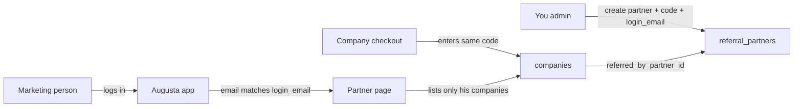

# Marketing partner dashboard — implementation plan

## Goal

You generate **one reusable referral code** for a marketing person. They log in with a normal Augusta account and open a **Partner** page that lists **only companies** who used their code at Company checkout. No full admin.

## What already exists

| Piece | Status |
|--------|--------|
| `referral_partners` table (name, code, is_active, notes, commission_note) | Done |
| `companies.referred_by_partner_id` set at checkout when referral entered | Done |
| Admin: create partners + list all companies with partner filter | Done (`CompanyReferralAdminPanel`) |
| Code is **reusable** (not one-time) | Done |

## Gap to close

`referral_partners` has **no link to a login**. The Partner page needs: “this logged-in email ↔ this partner row.”



---

## Scope — v1 (build this)

### In scope
- Link partner ↔ login email
- Partner sees: his **code**, **companies** (name, plan/seats, status, owner email, date), **counts** (active / pending)
- Dashboard tab **Partner** only if linked
- Backend enforces filter (never trust the client)

### Out of scope for v1
- Full admin / passcode create
- Editing commission / Stripe payouts in-app
- Attributing **Professional $49** (individual) — company plans only
- Partner creating more referral codes themselves

### Optional v1.1
- Estimated share line: e.g. `active Small × $150` + `active Large × $X` (from your 50/50 rule), clearly labelled “estimate — paid outside app”

---

## Step 1 — Database

Add to `supabase/combined_setup.sql` (idempotent):

```sql
ALTER TABLE referral_partners
  ADD COLUMN IF NOT EXISTS login_email TEXT;

-- One partner identity per email (case-normalized in app)
CREATE UNIQUE INDEX IF NOT EXISTS idx_referral_partners_login_email
  ON referral_partners (lower(login_email))
  WHERE login_email IS NOT NULL AND login_email <> '';
```

Optional later: `user_id UUID REFERENCES auth.users` filled when they first log in (nice-to-have; email match is enough for v1).

**Ops:** run updated `combined_setup.sql` (or just the ALTER + index) in Supabase SQL Editor.

---

## Step 2 — Admin: create / edit partner with login email

**Backend** (`company_service.create_referral_partner` + optional `update_referral_partner`):
- Accept `login_email` (normalize: strip + lower)
- Reject duplicate email
- Keep existing code uniqueness

**Admin API**
- Extend `POST .../admin/referral-partners` body with `login_email`
- Optional `PATCH .../admin/referral-partners/{id}` to set/change email or deactivate

**Frontend** (`CompanyReferralAdminPanel`)
- Form field: **Partner login email** (must be their Augusta signup email)
- Partners table column: linked email / “not linked”

**Your workflow**
1. Marketing person signs up normally (Sole is fine)
2. You create partner: name + code + their email
3. Tell them the code to give firms

---

## Step 3 — Partner API (scoped)

New endpoints (auth required, **not** admin):

### `GET /api/v1/subscriptions/my-partner`

Resolve partner:

```text
SELECT * FROM referral_partners
WHERE lower(login_email) = lower(current_user.email)
  AND is_active = true
```

If none → `404` or `{ "is_partner": false }`.

If found → return:

```json
{
  "is_partner": true,
  "partner": {
    "id": "...",
    "name": "...",
    "code": "NAJAM",
    "commission_note": "50% of post-overhead pool…"
  },
  "summary": {
    "active": 2,
    "pending": 1,
    "inactive": 0,
    "total": 3
  },
  "companies": [
    {
      "id": "...",
      "name": "Tradecyrus",
      "status": "active",
      "max_seats": 25,
      "seats_used": 4,
      "plan_label": "Company Small",
      "owner_email": "admin@firm.com",
      "created_at": "..."
    }
  ]
}
```

**Security rules**
- Filter strictly: `companies.referred_by_partner_id = partner.id`
- Do **not** return other partners, join codes of unrelated firms (optional: hide `join_code` on partner view — not needed for him)
- Do **not** reuse admin list endpoint with a client-side filter

`plan_label`: derive from `max_seats` (25 → Small, 50 → Large) — same as today.

---

## Step 4 — Frontend Partner page

**Detect partner**
- On dashboard load (or light `/my-partner` call): if `is_partner`, show tab **Partner** (or **Referrals**)
- Do **not** add them to `ADMIN_EMAIL_ALLOWLIST` / `REACT_APP_ADMIN_EMAIL_ALLOWLIST`

**UI (`PartnerDashboardPanel.tsx`)**
- Header: partner name + **referral code** with copy button
- Short note: “Firms enter this code at Company checkout. Same code for every company.”
- Summary pills: Active / Pending / Total
- Table: Company · Plan · Status · Owner · Seats used/max · Since
- Empty state: “No companies yet — share your code at checkout.”

**Nav**
- Add to `userTabs` when partner (or merge into account area). Keep admin tabs separate.

---

## Step 5 — Commission display (optional v1.1)

Do **not** auto-pay. Display only:

- From `commission_note` free text, **or**
- Simple estimate if you hardcode rates in env later:
  - Small active → e.g. $150
  - Large active → e.g. $275 (if you define 50/50 on $1,099 the same way)

Label clearly: **Estimate — settled outside Augusta**.

---

## Step 6 — Test plan

1. Create partner `TESTMKT` + login_email = marketer’s account  
2. Log in as marketer → Partner tab visible; list empty  
3. Log in as other user → no Partner tab  
4. Checkout Company Small with referral `TESTMKT` → webhook activates  
5. Marketer refresh → company appears, status active  
6. Second company same code → both listed  
7. Company with **other** code → not visible to marketer  
8. Confirm marketer **cannot** open admin Companies / passcodes / NCC  

---

## Step 7 — Deploy

1. Supabase: run SQL for `login_email`  
2. VPS1: `git pull` → restart `aus-augusta-backend` → frontend build → copy to `/var/www/aus-augusta-frontend/` → nginx reload  
3. Create real partner in Admin → Companies & referrals  

---

## Decision locks (confirm before coding)

| Item | Decision |
|------|----------|
| Attribution | Company checkout only (Small/Large) |
| Code reuse | One code, many companies |
| Access | Email match on `referral_partners.login_email` |
| Admin | Marketing person is **not** on admin allowlist |
| Passcodes | Out of v1 (you create if needed) |
| Payouts | Outside app; page is visibility + confidence |

---

## Effort estimate

| Slice | Effort |
|-------|--------|
| SQL + admin email field | Small |
| `/my-partner` API | Small–medium |
| Partner UI + tab | Medium |
| Optional share estimate | Small |
| Deploy + smoke | Small |

**v1 can ship in one focused pass** without touching Stripe or admin power.

---

## Later (not this plan)

- Partner-created limited passcodes  
- Professional ($49) referral attribution  
- Multi-code per partner / campaign codes  
- PDF export of attributed companies for the month  
