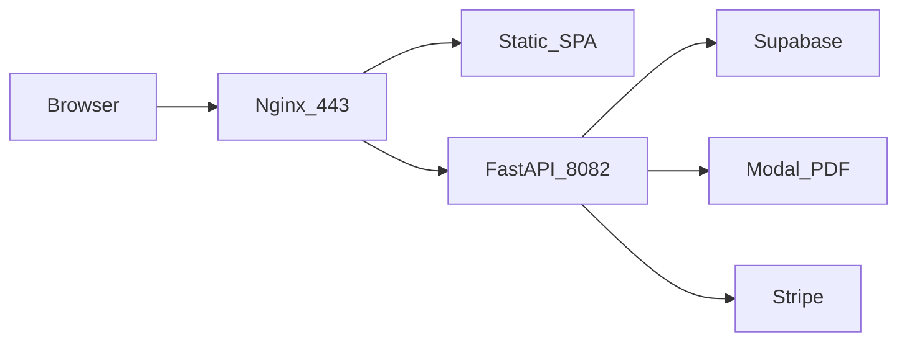

# Move Augusta to new VPS (Plan A)

**New server:** `root@37.60.238.78`  
**Old server:** `ragadmin@213.199.49.234`  
**Domain:** `ausstd.augustasearch.com`  
**App path:** `/home/ragadmin/ragadmin/projects/AUS-Augusta`

Automated scripts live in [`deploy/scripts/`](scripts/).

---

## Quick runbook (in order)

### Step 1 — Prepare new server (as root)

```bash
ssh root@37.60.238.78
```

Option A — clone repo first, then run script:

```bash
apt-get update && apt-get install -y git
git clone https://github.com/nsaqib238/AUS-Augusta.git /tmp/AUS-Augusta
bash /tmp/AUS-Augusta/deploy/scripts/01-prepare-server.sh
passwd ragadmin   # set password if prompted
```

Option B — after full clone in step 2, run from project dir.

---

### Step 2 — Clone app + copy `.env` from old VPS (as ragadmin)

```bash
ssh ragadmin@37.60.238.78
bash /tmp/AUS-Augusta/deploy/scripts/02-clone-and-env.sh
```

Or if repo already at project path:

```bash
cd ~/ragadmin/projects/AUS-Augusta
bash deploy/scripts/02-clone-and-env.sh
```

Edit secrets if needed (do not print in chat):

```bash
nano backend/.env    # STRIPE_PRICE_PROFESSIONAL, etc.
nano frontend/.env
```

---

### Step 3 — Deploy backend, frontend, nginx (sudo)

```bash
cd ~/ragadmin/projects/AUS-Augusta
sudo bash deploy/scripts/03-deploy-services.sh
```

---

### Step 4 — Preflight (before DNS)

```bash
bash deploy/scripts/04-preflight-test.sh
```

From your **Windows PC**, temporary hosts test:

1. Edit `C:\Windows\System32\drivers\etc\hosts` as Administrator  
2. Add: `37.60.238.78  ausstd.augustasearch.com`  
3. Open `http://ausstd.augustasearch.com` (HTTPS after step 5)

---

### Step 5 — DNS cutover + SSL

1. In DNS panel, change **A record** for `ausstd.augustasearch.com` → `37.60.238.78`  
2. Wait 5–30 min for propagation  
3. On new VPS:

```bash
sudo bash deploy/scripts/05-certbot-ssl.sh
```

4. Remove temporary hosts file line on PC  
5. Test: login, Q&A, one PDF upload, Stripe checkout

Stripe webhook URL stays `https://ausstd.augustasearch.com/api/v1/webhooks/stripe` — no change if domain unchanged.

---

### Step 6 — Retire old server (after 24–48h stable)

On **old** VPS:

```bash
ssh ragadmin@213.199.49.234
bash ~/ragadmin/projects/AUS-Augusta/deploy/scripts/06-retire-old-augusta.sh
```

**Rollback:** point DNS back to old IP, re-enable old `aus-augusta-backend`.

---

## Architecture



---

## VPS settings (recommended)

| Setting | Value |
|---------|--------|
| Uvicorn workers | `1` |
| `DISABLE_CHUNK_EMBEDDINGS` | `true` (in backend `.env`) |
| Nginx `client_max_body_size` | `100m` |
| Backend port | `8082` |

---

## Routine updates on new VPS

See [update vps.md](../update%20vps.md) — same commands, new IP for SSH.
