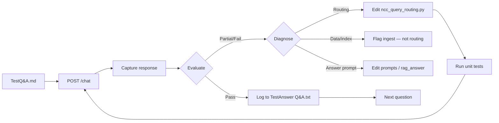

# NCC Q&A — Agent test loop 

run Vol 2 Set B agent test

How an AI agent (or developer) runs repeatable NCC RAG tests, evaluates answers, optimizes routing code, and logs results. Use this doc as the **source of truth** for future agent sessions.

---

## Purpose

Augusta Search answers NCC questions via a RAG pipeline (`rag_orchestrator` → ranker → answer LLM). Manual UI testing is slow and inconsistent. The **agent test loop** automates:

1. **Ask** — Send curated questions from the test bank.
2. **Capture** — Record answer text, citations, confidence, evidence count, timing.
3. **Evaluate** — Score Pass / Partial / Fail against expected NCC parts and pass criteria.
4. **Optimize** — Fix routing/retrieval/answer wiring when failures are code-related.
5. **Re-test** — Re-run failed or partial questions after changes.
6. **Log** — Append a session block to the results log for regression tracking.

This does **not** replace unit tests (`backend/tests/test_ncc_query_routing.py`) or a full compliance audit. It validates that the pipeline retrieves the **right clauses** and produces **practitioner-usable** evidence-bound answers.

---

## Related files

| File | Role |
|------|------|
| [`docs/TestQ&A.md`](./TestQ&A.md) | **Question bank** — questions + “what a good answer should touch” + explicit fail conditions |
| [`docs/TestAnswer Q&A.txt`](./TestAnswer%20Q%26A.txt) | **Results log** — session summaries and per-question evaluator notes |
| [`backend/services/ncc_query_routing.py`](../backend/services/ncc_query_routing.py) | **Routing** — question classification, prefetch anchors, scoring, ranker/answer hints (Vol 1 + Vol 2) |
| [`backend/services/rag_orchestrator.py`](../backend/services/rag_orchestrator.py) | Pipeline wiring — prefetch, ranker fallback, evidence sort |
| [`backend/services/rag_answer.py`](../backend/services/rag_answer.py) | Answer LLM — evidence narrowing, route hints, insufficient retry |
| [`backend/tests/test_ncc_query_routing.py`](../backend/tests/test_ncc_query_routing.py) | **Unit tests** — routing/scoring without LLM (run after every routing change) |
| [`backend/api/v1/chat.py`](../backend/api/v1/chat.py) | **API** — `POST /api/v1/chat` |

---

## How the agent loop works



### Step 1 — Configure run

- **One volume per run:** `dataset_ids: ["ncc2022_vol1"]` OR `["ncc2022_vol2"]` OR `["ncc2022_vol3"]`.
- **State filter:** Omit unless testing state variations (`state_filter: "NSW"` etc.).
- **Backend:** Local `http://localhost:8000` (dev) or production per [`PRODUCTION_SETUP_STEP_BY_STEP.md`](../PRODUCTION_SETUP_STEP_BY_STEP.md).
- **Auth:** Chat requires `Authorization: Bearer <supabase_jwt>` (see API below).

Pick a **set** from `TestQ&A.md` (e.g. Vol 2 Set B, questions 6–10) and note the **routing version** if known (from `TestAnswer Q&A.txt` next actions).

### Step 2 — Ask (API)

```http
POST /api/v1/chat
Authorization: Bearer <token>
Content-Type: application/json

{
  "query": "<exact question from TestQ&A.md>",
  "mode": "standard_query",
  "dataset_ids": ["ncc2022_vol2"],
  "debug": true,
  "state_filter": null
}
```

**Capture from response:**

| Field | Use |
|-------|-----|
| `final_markdown` | Practitioner summary + citations (evaluate content) |
| `confidence` | Shown in UI; low confidence + wrong citations → investigate ranker |
| `used_clauses` | Primary citations (must match expected parts) |
| `evidence_unit_count` | Very low (e.g. &lt;10) often indicates retrieval miss |
| `debug.steps` | Optional: `ncc_route.kinds`, retrieval counts, ranker fallback |

**Optional UI path:** Same questions in Augusta Search with one volume selected; paste results into the log (human or agent).

### Step 3 — Evaluate

Use the **Pass criteria** row in `TestQ&A.md` for that question, plus general rules:

| Grade | Meaning |
|-------|---------|
| **Pass** | Correct NCC part(s); answers the question (yes/no/depends or numeric/table where required); evidence-bound; no invented clause IDs |
| **Partial** | Right theme/part family but missing applicability, numbers, table values, or cites performance (P*) instead of DTS (D*) when DTS expected |
| **Fail** | `insufficient_evidence`; wrong volume/part; spec-only when applicability asked; wrong state variation without filter; classification-only (e.g. A6G6 only) |

**Common failure patterns (and where to fix):**

| Symptom | Likely cause | Fix layer |
|---------|--------------|-----------|
| Wrong part in citations (e.g. H7 bushfire for smoke) | Missing or weak route | `ncc_query_routing.py` |
| Right part in supporting pool, wrong in answer | Ranker or evidence cap | orchestrator merge + `rag_answer` narrowing |
| `insufficient_evidence` but clause exists in NCC | Prefetch / retrieval | Add `route_prefetch_anchor_ids`, extra_queries |
| Correct routing, empty clause text | Dataset / ingest | **Not routing** — check `ncc_units` / embeddings |
| Applicability question, only “how to install” | Ranker prefers Spec over DTS | Route hints + deprioritize Spec prefixes |

### Step 4 — Optimize (when agent is allowed to change code)

**Do change:**

- `analyze_ncc_query` / `_analyze_ncc_vol2_query` — new `kinds`, `extra_queries`, `deprioritize_prefixes`
- `route_prefetch_anchor_ids` — direct fetch of known DTS anchors (H4D2, H5D1, E2D3, …)
- `score_unit_for_route` — boost/penalize anchors
- `answer_routing_hint` / `ranker_routing_hint` — LLM instructions
- `rag_orchestrator.py` — pass `dataset_ids` into routing; prefetch wiring

**Do not change** (unless explicitly requested):

- Answer truth / compliance interpretation in prompts beyond routing hints
- Unrelated refactors

**After every routing edit:**

```bash
cd backend
python -c "import sys; sys.path.insert(0,'.'); from tests import test_ncc_query_routing as t; [getattr(t,n)() for n in dir(t) if n.startswith('test_')]"
```

Restart backend (`uvicorn` reload or `systemctl restart aus-augusta-backend` on VPS).

### Step 5 — Re-test and log

- Re-run **only** questions that were Partial/Fail (or full set for regression).
- Append a **SESSION N** block to `docs/TestAnswer Q&A.txt`:
  - Date, time, dataset, state filter, routing version note
  - Summary table (question → result → confidence)
  - Per-question: citations, evaluator notes, Pass/Partial/Fail
- Update **Next actions** at bottom of log with remaining gaps.

**Session naming convention:**

- Vol 1 Set A/B/C — numbered sessions in log (Sessions 2–5, etc.)
- Vol 2 Set A — Session 6 (first run), Session 7 (re-test), …
- Vol 2 Set B — Session 8, Session 9 (re-test after v5), …

---

## Routing reference (current)

Vol 1 routes live in `_analyze_ncc_vol1_query` (smoke, travel_distance, fire_hydrant, accessibility, stairs, section_j, frl, …).

Vol 2 routes live in `_analyze_ncc_vol2_query`:

| Route kind | Typical questions | Key anchors |
|------------|-------------------|-------------|
| `vol2_bushfire` | BAL, bushfire construction | H7D1–H7D5 |
| `vol2_room_height` | Ceiling height, habitable room **height** | H4D1 |
| `vol2_smoke` | Smoke alarms Class 1a | H3D* |
| `vol2_bracing` | Timber bracing | H1D6 |
| `vol2_energy` | Building fabric | H6D2 |
| `vol2_nathers` | NatHERS path | S42C*, H6V* |
| `vol2_wet_areas` | Bathroom waterproofing | H4D2, H4D3 |
| `vol2_light_vent` | Natural light, ventilation | H4D5–D7 |
| `vol2_pool` | Pool barriers | H7D2 |
| `vol2_stairs` | Riser/going Class 1 | H5D1 |

Vol 2 detection: `is_ncc_vol2_dataset(dataset_ids)` when **all** selected IDs match `ncc2022_vol2`.

---

## Agent checklist (copy per run)

```
[ ] Read TestQ&A.md — confirm set and dataset_id
[ ] Read TestAnswer Q&A.txt — last session + next actions
[ ] Backend running; routing changes deployed if testing post-fix
[ ] Auth token available for POST /chat (or use UI + paste)
[ ] Run questions one volume at a time
[ ] For each: record confidence, citations, evidence count, Pass/Partial/Fail
[ ] Diagnose failures (routing vs data vs ranker vs answer)
[ ] If routing fix: edit ncc_query_routing.py → unit tests → restart → re-run fails
[ ] Log SESSION block to TestAnswer Q&A.txt
[ ] Update next actions; do not git commit unless user asks
```

---

## Future automation (not implemented yet)

A script or agent skill could:

1. Parse `TestQ&A.md` tables into `{id, question, dataset_id, pass_criteria}`.
2. Call `POST /api/v1/chat` for each row.
3. Rule-score: regex for expected anchor prefixes (e.g. `H4D2`), fail on `insufficient_evidence`, flag missing `\d+\s*m` when criteria require numbers.
4. Emit JSON + optional append to `TestAnswer Q&A.txt`.
5. Open PR or patch routing when score &lt; threshold and `debug.ncc_route` shows wrong `kinds`.

Until that exists, the **Cursor agent** follows this doc manually: API or UI → evaluate → patch → unit test → re-run.

**Implemented runner:** `backend/scripts/run_ncc_agent_test.py` (calls `rag_orchestrator.run` directly — no HTTP auth).

```bash
cd backend
# Use Python 3.10 (same env as uvicorn — has supabase installed)
py -3.10 scripts/run_ncc_agent_test.py --set all --limit 20 \
  --out ../docs/agent-test-vol2-session9.json

# Re-run specific questions after a routing fix
py -3.10 scripts/run_ncc_agent_test.py --nums 2,9,18 \
  --out ../docs/agent-test-vol2-retest.json
```

Options: `--set a|b|c|all`, `--limit N`, `--nums 2,9,18`, `--debug`.

Output: JSON with `grade`, `used_clauses` (full evidence pool), `answer_preview`, `notes`. Full log also useful for human review.

**Question bank:** Vol 2 Set A (1–5), Set B (6–10), Set C (11–20) in `TestQ&A.md` — 20 topic types total.

---

## What “good enough” means per volume

| Volume | Status (as of Jun 2026) | Agent priority |
|--------|-------------------------|----------------|
| Vol 1 | ~11 pass, ~4 partial on best runs; acceptable for now per user | Re-run Q2, Q9, Q14, Q15 if optimizing |
| Vol 2 Set A | Q3/Q5 pass; Q1/Q2/Q4 partial/fail — v4 routing pending re-test | Re-test after backend restart |
| Vol 2 Set B | Q10 pass; Q6/Q9 fail, Q7/Q8 partial — v5 routing pending re-test | **Primary** agent target after restart |
| Vol 3 | Not started | Add routes when Vol 3 testing begins |

---

## Commands quick reference

```bash
# Local backend (from backend/)
python -m uvicorn main:app --reload --host 0.0.0.0 --port 8000

# Routing unit tests
cd backend && python -c "import sys; sys.path.insert(0,'.'); from tests import test_ncc_query_routing as t; [getattr(t,n)() for n in dir(t) if n.startswith('test_')]"

# Example chat (replace TOKEN and question)
curl -s -X POST http://localhost:8000/api/v1/chat \
  -H "Authorization: Bearer TOKEN" \
  -H "Content-Type: application/json" \
  -d "{\"query\":\"Is a smoke alarm required in a Class 1a dwelling?\",\"dataset_ids\":[\"ncc2022_vol2\"],\"debug\":true}"
```

---

## Instructions for AI agents

When the user says **“run agent test”**, **“test Vol 2 Set B”**, or **“evaluate NCC Q&A”**:

1. Read **this file** and **`TestQ&A.md`** for the requested set.
2. Read **`TestAnswer Q&A.txt`** for prior sessions and avoid duplicate work.
3. Execute the loop (API or ask user to paste UI results if no auth).
4. Log results in **`TestAnswer Q&A.txt`** using the same format as existing sessions.
5. Optimize **`ncc_query_routing.py`** only when diagnosis points to routing; run unit tests after edits.
6. Do **not** commit unless the user explicitly asks.

When the user says **“Vol X is ok for now”**, stop expanding test sets for that volume unless they ask again.
